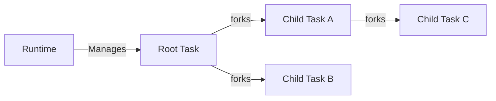

---
# try also 'default' to start simple
theme: dracula
# random image from a curated Unsplash collection by Anthony
# like them? see https://unsplash.com/collections/94734566/slidev
# apply any windi css classes to the current slide
class: 'text-center'
# https://sli.dev/custom/highlighters.html
highlighter: shiki
# show line numbers in code blocks
lineNumbers: false
# some information about the slides, markdown enabled
info: |
  ## Antoine Coulon, Paris TypeScript #1
  
  Using Effect to build Production-Ready TypeScript Software
# persist drawings in exports and build
drawings:
  persist: false
# use UnoCSS (experimental)
css: unocss
---

## Using Effect to build Production-Ready TypeScript Software

<br>
<br>

**Antoine Coulon** @ **Paris TypeScript la Conf'** #1

---
layout: center
class: "text-center"
---

# Effect: the **why** rather than the **how**

---

<div class="grid grid-cols-10 gap-x-4 pt-5 pr-10 pl-10">

<div class="col-start-1 col-span-7 grid grid-cols-[3fr,2fr] mr-10">
  <div class="pb-4">
    <h1><b>Antoine Coulon</b></h1>
    <div class="leading-8 mt-8 flex flex-col">
      <p class="mt-3">Freelance Lead Software Engineer</p>
      <p class="mt-3">Author <b color="orange">skott, effect-introduction</b></p>
      <p class="mt-3">Advocate <b color="orange">Effect</b></p>
      <p class="mt-3">Contributor <b color="orange">NodeSecure</b></p>
    </div>  
  </div>
  <div class="border-l border-gray-400 border-opacity-25 !all:leading-12 !all:list-none my-auto">
  </div>

</div>

<div class="pl-20 col-start-8 col-span-10">
  

  <div class="mt-5">
    <div class="mb-4 flex justify-between"><ri-github-line color="blue"/> <b color="opacity-30 ml-2">antoine-coulon</b></div>
    <div class="mb-4 flex justify-between"><ri-twitter-line color="blue"/> <b color="opacity-30 ml-2">c9antoine</b></div>
    <div class="mb-4 flex justify-between"><ri-user-3-line color="blue"/> <b color="opacity-30 ml-2">dev.to/antoinecoulon</b></div>
  </div>
</div>

</div>

<style>
  h1 {
    color: #4c7fff;
  }
  img {
    margin: 0 auto;
  }
</style>

---

## Building Production-Ready Software: the challenges

<br>

> non-exhaustive

- **Resilience**: error management, retries, interruptions, timeouts

- **Dependencies**: composition, testing, decoupling, dependency injection

- **Concurrency**: efficiency, race conditions, starvation, resource-safety

- **Resource management**: resource-safety guarantees, leaks

- **Observability**: tracing, logging, metrics

---

## The JavaScript ecosystem: massive but fragmented

<br>

> non-exhaustive

- **Control flow**: ts-results, neverthrow, p-retry

- **Dependency injection**: tsyringe, di, awilix, inversify

- **Schema validation**: zod, yup, joi, arktype

- **FP librairies**: fp-ts, ramda

- **Data structures**: immer, immutable-js


---

## Introducing Effect: a unified solution to most of these challenges

<br>

> The Effect generic data type is a description of a Program

<div class="text-center">

<br>

## `Effect<A, E, R>`

</div>

<br>

- [**A**] Success `Effect<Success>`

- [**E**] Failures `Effect<Success, Failures>`

- [**R**] Requirements `Effect<Success, Failures, Dependencies>`

---

## Effect is explicit: success, failures, dependencies 

> An Effect is an explicit description of a Program

```ts
import { Effect } from "effect";

const createUser: Effect.Effect<CreatedUser, UserAlreadyExists, UserRepository> = //
```

<div v-click class="pt-2">

<p class="p-2 text-center">And all these type parameters can leverage discriminated unions to encode multiple possibilities.</p>


```ts
type Success = CreatedUser;
type Failures = UserAlreadyExists | OrganizationNotFound;
type Requirements = UserRepository | OrganizationRepository;

const createUser: Effect.Effect<Success, Failures, Requirements> = //
```

<p class="text-center pt-2">⚠️ Don't worry you don't need to type all that, everything is inferred</p>
</div>

---

## Resilience: error management

<br>

> Resilience is the art of designing and implementing systems which can react and recover from expected failures.

<div class="grid grid-cols-2 gap-x-4 pt-2">

<div>

**Synchronous operations**

```ts
// random.ts
export function generateRandomNumber(): number {
  // 
}
```

```ts
// main.ts
import { generateRandomNumber } from "./random";

function main() {
  return generateRandomNumber() * 10;
}
```
</div>

<div v-click>

**Asynchronous operations**

```ts
interface Promise<T> {}

async function generateRandomNumber(): Promise<number> {
  //
}

generateRandomNumber().catch((_: any) => {});

try {
  await generateRandomNumber();
} catch (exception: unknown) {}
```

</div>


</div>

<div class="text-center mt-5" v-click>
<b>→ End up using defensive programming: just in case ™</b>
<br>
<b>→ Same explicitness problem and different APIs</b>
</div>


---

## Resilience: error management

> Re-creating information that we had... but lost during the process

<div>

```ts
function isSomeErrorException(exception: unknown): exception is SomeError {
  return exception instanceof Error && exception.name === "SomeError";
}

function isSomeOtherErrorException(exception: unknown): exception is SomeOtherError {
  return exception instanceof Error && exception.name === "SomeOtherError";
}

try {
  generateRandomNumber();
} catch (exception: unknown) {
  // Worst case? We don't even know what to expect from "exception"

  // Best case:
  if (isSomeErrorException(exception)) {
    // do something
  } else if (isSomeOtherErrorException(exception)) {
    // do something else
  }
}
```

</div>

---

## Resilience: error management with Effect

> Introducing Errors as Values

```ts {3-9|1,11-12|1,11-20|1,22} {lines:true}
import { Effect, pipe } from "effect";

class NumberIsTooBigError {
  readonly _tag = "NumberIsTooBigError";
}

class NumberIsTooSmallError {
  readonly _tag = "NumberIsTooSmallError";
}

export const generateRandomNumber: Effect.Effect<number, NumberIsTooBigError | NumberIsTooSmallError, never> = //

const main = pipe(
  generateRandomNumber,
  // exhaustive pattern matching
  Effect.catchTags({
    NumberIsTooBigError: () => Effect.succeed(0),
    NumberIsTooSmallError: () => Effect.succeed(1),
  })
);

type Main = Effect.Effect<number, never, never>;
```

---

## Resilience: more than just managing errors


<div class="grid grid-cols-2 gap-x-4 pt-2">

<div>

**Retrying**

```ts
import { Effect, pipe, Schedule, Duration } from "effect";

const schedulePolicy = pipe(
  Schedule.recurs(5),
  Schedule.addDelay(() => Duration.millis(500)),
  Schedule.compose(Schedule.elapsed),
  Schedule.whileOutput(
    Duration.lessThanOrEqualTo(Duration.seconds(3))
  ),
  Schedule.whileInput(
    (e) => e instanceof Error && e.message !== "_"
  )
);

const programWithRetryPolicy = pipe(
  Effect.failSync(() => new Error("Some_error")),
  Effect.retry(schedulePolicy),
  Effect.catchAll(() => Effect.sync(() => {
    console.log("Program ended")
  }))
);
```
</div>

<div v-click>

**Resource-safe interruptions and timeouts**

<div>

→ An Effect is interruptible by default
<br>
→ Interruptions are guaranteed to be propagated


```ts
import { Effect } from "effect";

const task = Effect.gen(function* () {
  console.log("Start processing...");
  yield* Effect.sleep("2 seconds");
  console.log("Processing complete.");
  return "Result";
});

const timedEffect = task.pipe(Effect.timeout("1 second"));
```
</div>

</div>


</div>


---

## Dependencies: Effect has your back

> Program to an interface, not an implementation

```ts {0|2-3|4|all} 
interface Effect<
  A, // success channel
  E, // errors channel 
  R, // dependencies channel
> {}
```

<div v-click>

<b class="mt-3">Built-in decoupling through Dependency Inversion Principle</b>

```ts
import { Effect, Context } from "effect";

interface UserRepository {
  createUser: () => Effect.Effect<CreatedUser, UserAlreadyExistsError, never>;
}

const UserRepository = Context.GenericTag<UserRepository>("UserRepository");

const registerUser: Effect.Effect<CreatedUser, UserAlreadyExistsError, UserRepository> = Effect.gen(function* () {
  const repository = yield* UserRepository
  
  yield* userRepository.createUser()
});


```
</div>

---

## Dependencies: type-safe dependency injection

<br>

```ts {1,9-11|3,6-7|13-18|13,20-21} {lines:true}
import { Effect, pipe } from "effect";

const registerUser: Effect.Effect<
  CreatedUser,
  UserAlreadyExistsError,
  UserRepository
> = // whatever Effect there

// ts(2345): Type 'UserRepository' is not assignable to type 'never'
//             ^^^^^^^^^^^^
Effect.runSync(registerUser);

const registerUserWithSatisfiedDependencies: Effect<CreatedUser, UserAlreadyExistsError, never> = pipe(
  registerUser,
  Effect.provideService(UserRepository, {
    createUser: () => Effect.succeed(new CreatedUser()),
  })
);

// compiles and works
Effect.runSync(registerUserWithSatisfiedDependencies);
```

---

## Dependencies: seemless testing

> Dependency Inversion Principle makes testing easy

```ts {1-5|8,12|all} {lines:true}
class InMemoryUserRepository implements UserRepository {
  createUser() {
    //
  }
}

test("Should blabla", async () => {
  const fakeRepository = new InMemoryUserRepository();

  const user = await pipe(
    createUser(), 
    Effect.provideService(UserRepository, fakeRepository),
    Effect.runPromise
  );

  expect(user).toEqual("whatever");
});
```

---


## Concurrency: properly managing concurrency is **complex**

> "concurrency is about dealing with lots of things at once", Rob Pike

<br>

- Avoiding starvation, deadlocks, resource leaks, race conditions 
- Offering resource-safety through cancellation with proper finalization mechanisms
- Dealing with error management and propagation
- Providing efficient concurrency (CPU + Memory)
- APIs gaps between concurrent and non-concurrent code 

<br>

<div class="grid grid-cols-[3fr_2fr] gap-x-4 pt-1" v-click>
    
  <div class="pt-15">
    <b>⚠️ The Event-Loop solve many concurrency issues... but not all</b>
  </div>

  <div class="flex justify-center">
    
  </div>

</div>

---

## Concurrency: Promises are lacking important features

<div class="grid grid-cols-2 gap-x-4 pt-1">

<div v-click>

**Promise**

```ts
const userIds = Array.from(
  { length: 1000 }, (_, idx) => idx
);

function fetchUser(id: number): Promise<User> {}

// UNBOUNDED 
function retrieveAllUsers() {
  return Promise.all(userIds.map(fetchUser));
}
```

- No interruption handling
- No guarantee on resource release
- No control over concurrent execution
- `Promise#allSettled` provides finer control over the produced result but suffers from the same issues

</div>

<div v-click>

**Effect**

```ts
const userIds = Array.from(
  { length: 1000 }, (_, idx) => idx
);

const retrieveAllUsers = pipe( 
  userIds,
  // SEQUENTIAL (default)
  Effect.forEach(
    (id) => Effect.promise(() => fetchUser(id)), 
    // BOUNDED CONCURRENCY
    { concurrency: 30 },
    // OR UNBOUNDED CONCURRENCY
    { concurrency: "unbounded" },
    // OR INHERITED CONCURRENCY
    { concurrency: "inherit" }
  )
);
```

</div>

</div>

---

## Resource Management: interruptions and errors support


<div class="grid grid-cols-2 gap-x-4 pt-5">

<div>

```ts {1-5|7-24}
import { setTimeout } from "node:timers/promises";

const leakingRace = () => Promise.race([
  setTimeout(1_000), setTimeout(5_000)
]);

const raceWithInterruptions = () => {
  const a1 = new AbortController();
  const a2 = new AbortController();

  async function cancellableTimeout1() {
    await setTimeout(1_000, void 0, { signal: a1.signal });
    a2.abort();
  }

  async function cancellableTimeout2() {
    await setTimeout(5_000, void 0, { signal: a2.signal });
    a1.abort();
  }

  return Promise.race([
    cancellableTimeout1(), cancellableTimeout2()
  ]);
}
```
</div>

<div v-click>

```ts
import { Effect } from "effect";

const race = Effect.raceAll([
  Effect.sleep(1000),
  Effect.sleep(10_000).pipe(
    Effect.onInterrupt(() => Effect.log("interrupted"))
  ),
]);
```

**And many ways of describing finalizers**

```ts
// React useEffect-like release function
const backgroundJob = Effect.async(() => {
  const timer = setInterval(() => {
    console.log("processing job...");
  }, 500);

  return Effect.sync(() => {
    console.log("releasing resources...");
    clearInterval(timer);
  });
});
```


</div>


</div>

---

## Resource Management: modeling resource-safe flows

<br>

- Scopes offer handle with built-in acquisition and release logic with strong guarantees
- Finalizers are guaranteed to be run in case of Interruptions or Errors
- No props drilling, everything nicely composes
- Interruptions are guaranteed to be propagated, following Structured Concurrency model

<div class="pt-2 text-center">

<p color="orange"> Structured Concurrency also allows resource-safety </p>


</div>


--- 

## Observability: built-in Logging, Tracing, Metrics

> Built-in support for Logging, Tracing, Metrics

<div class="grid grid-cols-2 gap-x-4 pt-5">

<div>


```ts {all} 
import { Metric, Effect } from "effect"

const requestCount = Metric.counter("request_count", {
  description: "A counter for tracking requests"
})
```

```ts {4|6,15|all}
import { Effect } from "effect"

const child = pipe(  
  Effect.log("Something to log"),
  Effect.delay("100 millis"),
  Effect.withSpan("child")
)

const parent = pipe(
  Effect.gen(function* () {
    yield* Effect.sleep("20 millis")
    yield* child
    yield* Effect.sleep("10 millis")
  }),
  Effect.withSpan("parent"),
)
```

</div>

<div class="pt-1">


</div>

</div>
---

## Effect offers a wide but unified and composable ecosystem

<br>

- Batching/Caching, built-in `effect/Request` module
- Streams, built-in `effect/Stream` module
- Schema Validation, built-in `effect/Schema` module
- Configuration Management, built-in `effect/Config` module
- Data structures, built-in `effect/Data` module
- State Management, built-in `effect/Ref` module
- Scheduling, cron-like built-in module, `effect/Cron` module
- many more, via `effect/*` modules

---

## Disclaimer

**Effect does not necessarily need to be an all-in**

<div>
  <ul>
      <li >It's a toolkit, you only pick what you need</li>
      <li >You don't need to use it everywhere: good promise/callback/sync interop</li>
      <li >Tree-shaking support</li>
  </ul>
</div>

<div class="flex justify-center">
  <video src="/discovery.mov" autoplay loop width="400"/>
</div>
---

## Effect makes the hard things easy

> Tackle hard problems with low complexity overhead

<div class="mt-5">

  

</div>

---

## Thanks for listening

<div class="grid grid-cols-[6fr_2fr] gap-x-2 pt-5">

<div class="mr-10">
    <ul class="leading-8 mt-8 flex flex-col">
    <li><b>Effect website</b>: <b color="cyan">https://effect.website</b></li>
    <li><b>Effect introduction</b>: <b color="cyan">https://github.com/antoine-coulon/effect-introduction</b></li>
    </ul>
</div>

<div class="pl-20">
  
  
</div>

</div>

